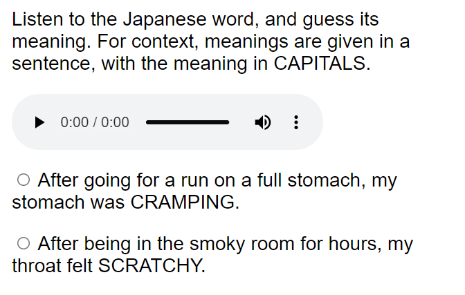
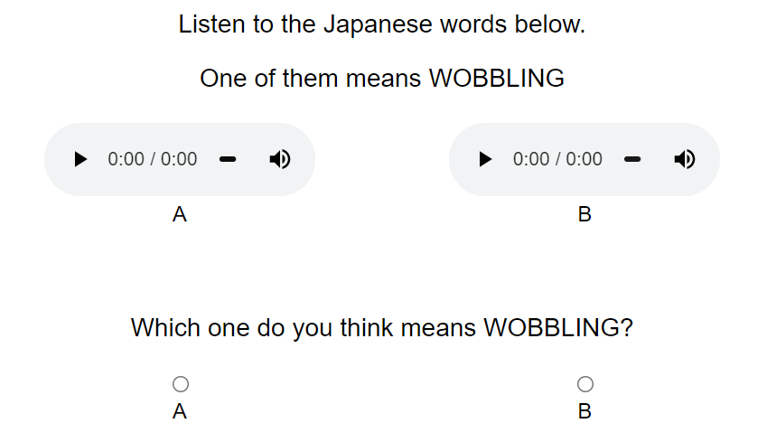
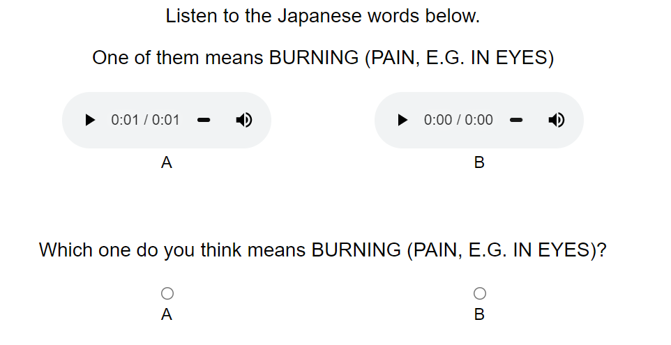
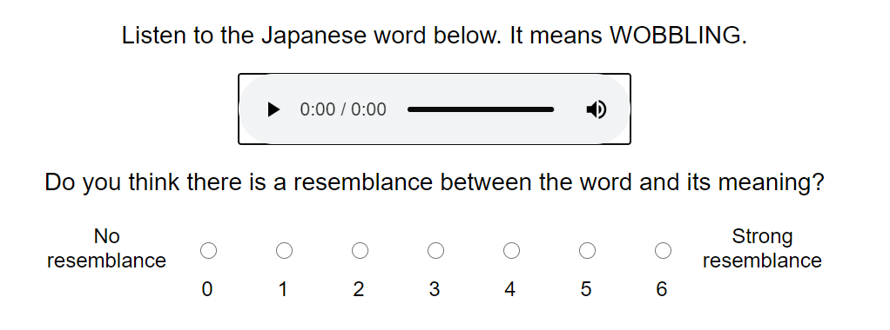
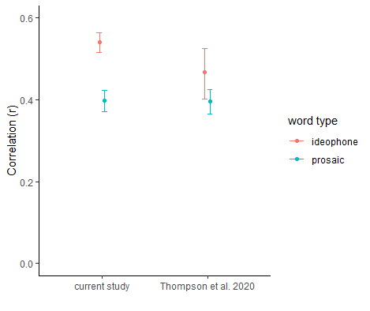

```{r setup, include=FALSE}
library(tidyverse)
library(kableExtra)
library(bookdown)
library(report)
library(lmerTest)
library(plotly)
library(corrr)
library(boot)
library(zeallot)
library(pander)
library(sjPlot)
library(ggeffects)
library(gridExtra)
library(gghalves)
knitr::opts_chunk$set(echo = TRUE,warning=FALSE,message = FALSE)
```

**Abstract** 

Iconicity in language is receiving increased attention from many fields, but our understanding of the roles of iconicity in language is only as good as the measures we use to quantify it. We conducted iconicity rating and guessing experiments with 304 Japanese ideophones and prosaic words with sensory meanings, e.g. *fuwafuwa* ‘fluffy’, *jawarakai* ‘soft’. For both word groups, ratings and guesses were positively correlated—suggesting the two measures pick up on the same associations. Ideophones were consistently associated with higher iconicity ratings, but not higher guessing accuracy. We suggest that the structural markedness of ideophones enhances their perceived iconicity in the rating task, but does not provide any advantage (over and above form-meaning associations) in the guessing task. Thus, guesses and ratings could be used together to tease apart the relative contribution of structural markedness to iconic effects. Some ideophones were also poorly guessed, highlighting that construals of iconicity can be language-specific. Finally, we present some methodological contributions, including a new guessing paradigm that improves on the robustness, sensitivity and discriminability of previous approaches, and a reproducible workflow for creating rating and guessing experiments with a Python package, `icotools`, which we hope will improve comparability between future studies.

**Keywords:** iconicity, ideophones, lexical norms, iconicity ratings, guessability 

# Introduction

What does it mean when we say that something is a "good word for" a concept? Certain words, like *klutz*, *schmooze*, and *smush*, seem to "suit" their meanings. We may have a sense that the French *belle* is a more appropriate word for BEAUTY than the Swedish *vacker*. Such intuitions are likely to be somewhat subjective, and influenced by our own linguistic experiences, but we all have them. The idea that certain forms can be particularly suited to certain meanings is known as *iconicity*.

Iconicity--defined here as a perceived resemblance between aspects of form and meaning--is now increasingly recognised as a *key property of language* [see e.g. @dingemanse_arbitrariness_2015; @perniss_iconicity_2010; @perniss_bridge_2014 for a review], raising questions about where iconic mappings come from, and what they do. To answer these questions, we first need to be able to *identify* iconicity in language and, ideally, to *measure* it. 

Approaches to measuring iconicity can be divided into descriptive, data-driven, and behavioural methods [@motamedi_iconicity_2019]. Of these, only descriptive approaches target *iconicity* directly, with other methods simply identifying form-meaning association *biases*--whether these be based on resemblance (as in iconicity), co-occurrence (indexicality), statistically driven associations (systematicity), functional advantages, or other factors. 

With descriptive approaches, iconicity as a theoretical concept is coded for directly [e.g. @pietrandrea_iconicity_2002; @hwang_body_2017; @ostling_visual_2018; @thompson_defining_2019; @voronin_osnovy_2006; @flaksman2020stanislav]. This is more common and straightforward for sign languages than for spoken languages [@thompson_defining_2019]. It is usually done manually, but Östling et al. [-@ostling_visual_2018] have shown for sign languages that (for some mappings at least) this can also be automated. Such studies usually involve cross-linguistic data, and aim to uncover universalities in how different languages map sound to meaning--that is, *where* iconicity comes from.  

A wider variety of approaches target iconicity *indirectly* through related phenomena. For example, data-driven approaches [e.g. @wichmann_sound_2010; @blasi_soundmeaning_2016; @joo_phonosemantic_2020; @johansson_typology_2020; @winter_trilledr] use comparisons across unrelated languages to identify form-meaning correspondences that occur at rates higher than chance. This requires large amounts of parallel data from distinct phyla, and existing studies usually focus on basic vocabulary--where such data is most readily available. Like descriptive approaches, data-driven approaches identify *specific* form-meaning associations involved in iconic effects, but with the added advantage of not needing to rely on the intuitions and manual labour of individual researchers. However, they *do* rely on the existence of translation equivalents in multiple languages for the words under study. This can pose a particular challenge for highly iconic words, as these often also have highly specific meanings [@lupyan_language_2018; @akita_toward_2012]. Thus, these approaches are less likely to be helpful for those with *specific* words for which iconicity measures are required.

Another body of work which capitalises on big data involves the study of *affective iconicity* [e.g. @ullrich_phonological_2016; @aryani_why_2018]. These studies use large datasets of affective norms to identify phonological segments loaded with affective meaning (by taking average affectiveness values across all words containing those segments, and identifying segments with values deviating from the global neutral mean). Although limited to associations involving affect, this approach has been successfully used to investigate iconic effects in language processing [@schmidtke_effects_2018; @aryani_affective_2018], and has even been used to explain the affective meaning of poems [@ullrich_relation_2017].

Behavioural approaches involve the collection of data from naive experimental participants, which can reveal something about the iconicity of given form-meaning pairings. The only requirement is the human participants for the study, and the largest amount of iconicity measurements from the widest variety of languages have been collected using these methods. There are two main approaches: iconicity rating tasks and guessing experiments. 

In iconicity rating tasks, the concept of iconicity is explained to participants, and participants are asked to rate the iconicity of given form-meaning pairs directly [e.g. @vinson_british_2008; @perry_iconicity_2015; @winter_which_2017; @occhino_iconicity_2017; @thompson_iconicity_2020; @punselie_iconicity_2020]. Measurements from these studies have been found to correlate in meaningful ways with factors related to iconicity--e.g. encoding of sensory information [@winter_which_2017], semantic domains [@punselie_iconicity_2020], semantic neighbourhood density [@sidhu_lonely_2018], word class [@perry_iconicity_2015; @thompson_iconicity_2020], age of acquisition [@vinson_british_2008; @perry_iconicity_2015], facilitated processing [@thompson_link_2009; @occhino_role_2020], funniness and structural markedness [@dingemanse_playful_2020]. However, ratings given are influenced by the linguistic experience of participants [@occhino_iconicity_2017; @sevcikova_sehyr_perceived_2019], so some care is needed to ensure measures are taken from appropriate participant groups. Further, ratings from native speakers may also capture non-iconic regularities like semantic transparency and indexicality [@dingemanse_playful_2020; @winter_iconicity_2021], so cannot be taken as direct reflections of degree of iconicity.

In guessing experiments, participants are asked to guess the meaning of foreign/novel signs from a choice of two or more alternatives [e.g. @kohler_gestalt_1929; @tsuru_problem_1933; @brown_phonetic_1955; @kunihira_effects_1971; @ramachandran_synaesthesia_2001; @dingemanse_what_2016; @tzeng_specificity_2017; @perlman_iconicity_2015; @perlman_people_2018; @lockwood_sound2016]. Signs whose meanings are correctly guessed at rates higher than chance are considered iconic. The guessability of signs has also been linked to facilitated processing [@ormel_role_2009] and learnability [@perlman_people_2018; @lockwood_sound2016], and correlated with iconicity ratings [@punselie_iconicity_2020]. However, some signs that were given low iconicity ratings were actually highly guessable, while there were also a few signs that, despite receiving high ratings, were not easily guessed  [@punselie_iconicity_2020: 23]. This suggests that guessing and rating tasks may tap into slightly different constructs, or be sensitive to experimental design constraints. 

While results from behavioural experiments often require some untangling, we believe that they are particularly valuable sources of iconicity measures for four reasons: (1) they can be applied to any kind of dataset, (2) they are scalable, being particularly amenable to online, crowd-sourced data collection, (3) they are tweakable, meaning that we can experiment with different experimental designs to figure out exactly what these measures are telling us, and (4) they are amenable to standardisation, making them a good option for reproducibility. In fact, they are the *only* measures of iconicity that we know of to combine all these things.  Moreover, that the measures correlate with each other and with a variety of other meaningful phenomena speaks to their validity.

In this study, we seek to further our understanding of these measures and how they can be useful by comparing and contrasting iconicity ratings and guesses for 304 Japanese words from the sensory vocabulary of Japanese. Sensory language was chosen as this is a domain high in iconicity, and where iconicity offers clear advantages [@winter_which_2017]. The data contained a mix of ideophones--depictive, eye-catching words like *fuwafuwa* 'soft' and *pikapika* 'sparkly' that "invite and afford the construal of iconic mappings between form and meaning" [@akita_ideophone_2019: 18]--along with prosaic lexical items, like *yawai* 'soft' and *hikaru* 'shine', which are not necessarily expected to be lacking in iconicity--especially given their sensory meanings--but which are less obvious about it. We were particularly interested in how the iconicity measures for these words would compare between the rating studies--where participants are asked to make a conscious decision about the iconicity of the words--and the guessing studies--which tap into more unconscious biases. We find that when used together, the two methods shed light on each other, as well as raising pertinent questions about where iconicity effects come from. Our conclusion is that, for many of the questions that we have about iconicity in language, two measures may be better than one.

To discover how to get the most out of each measure, we compare and contrast different rating and guessing paradigms, and in particular introduce a new guessing paradigm that improves on the robustness, discriminability and sensitivity of previous approaches. Finally, to promote the use of these new measures, we introduce a reproducible workflow for automatically generating rating and guessing experiments in a standardised format, via a python package `icotools`, with support for a variety of stimulus formats (audio, video, and images). This will make the collection of behavioural based iconicity measures quicker, easier, and more comparable between future studies. 

# Methods

The data from the study, as well as the code used to produce the experiments and analyses can be found on the Open Science Framework, at https://osf.io/j57uc/?view_only=0f15b81806434bc99c29566d68f3f715.

## Stimuli

The stimuli were 304 words taken from the *Japonic Sensory Lexicon* database [AUTHOR 2022], which is a collection of words for 110 sensory concepts in 49 Japonic varities. The words in the database were collated from three different sources: Sanada and Tomosada [-@sanada_kenbetsu_2015; -@sanada_kenbetsu_2018], and Hirayama [-@hirayama_gendai_1992]. Any available concepts related to the senses were included. For all three sources, words for each concept were collected from speakers of different Japonic varieties by asking the speakers to translate sentences from the standard variety into their local variety. Further description of the concepts and the sentences used to elicit them can be found in the Supplementary Materials.

The words used in this study come from the Yamato stratum of the Japanese lexicon, meaning that they are native Japanese words. The Yamato stratum can be further subdivided into prosaic words and ideophones [or mimetics, see e.g. @kageyama_handbook_2016]. Both types of words are found in the data from Sanada and Tomosada, whereas the data from Hirayama mainly consists of prosaic words. Figure \@ref(fig:stimuli) shows the words used in this study, including their semantic domains and membership of different lexical strata. A complete wordlist is provided in the Supplementary Materials. 

```{r stimuli,fig.cap="Word used in the study, by semantic domain and lexical stratum",echo=FALSE}
# semantic domains of concepts, plus numbers of ideophones and non-ideophones
concepts <- read_tsv("https://raw.githubusercontent.com/BonnieMcLean/JaponicSensoryLex/main/concepts.tsv")%>%
  rowwise()%>%
  mutate(concept=str_split(concept,"-")[[1]][1])%>%
  select(concept,domain)

words <- read_csv("responses-guessingwords.csv")%>%
  select(form,identifier)%>%
  mutate(identifier=str_replace_all(identifier,"FUZZY","CLEAR"))%>%
  rowwise()%>%
  mutate(concept=str_split(identifier,"_")[[1]][2])%>%
  unique()%>%
  left_join(concepts,by="concept")

words <- read_csv("ideophone_list.csv")%>%
  select(form,ideophone)%>%
  right_join(words,by="form")

# plus the practise and control items which arent in the Japonic sensory lexicon
words$domain[words$form == "yoroyoro"] <- "action"
words$domain[words$form == "fuwafuwa"] <- "texture"
words$domain[words$form == "hisohiso"] <- "sound"
words$domain[words$form == "pyoNpyoN"] <- "action"
words$domain[words$form == "zyiNzyiN"] <- "pain"
words$domain[words$form == "gaNgaN"] <- "pain"

words%>%
  unique()%>%
  group_by(domain)%>%
  count(ideophone)%>%
  mutate(stratum=ifelse(ideophone=="y","ideophone","prosaic"))->graph

graph$domain <- as.factor(graph$domain)

graph%>%
  mutate(domain=fct_relevel(domain,c("sound","action","shape & size","appearance","texture","temperature","taste","pain","bodily feeling","emotion")))%>%
  ggplot(aes(x=domain,y=n,fill=stratum))+geom_col()+theme_minimal()+labs(x="Semantic domain",fill="Lexical stratum")+theme(axis.text.x = element_text(angle=15))+scale_fill_manual(values=c("darkgrey","black"))+ coord_fixed(ratio = 0.1)
```

For all tasks, the words were presented to participants as audio files. The audio files were synthesised using the Google Cloud Text-to-Speech API [(https://cloud.google.com/text-to-speech)](https://cloud.google.com/text-to-speech), with the female Japanese Wavenet voice ja-JP-Wavenet-B. They were then edited using Praat [@boersma_praat_2020] to have a flat pitch of 200Hz. Expressive prosody can enhance performance in guessing tasks [@kunihira_effects_1971; @dingemanse_what_2016], and so using a flat intonation was seen as the best way to ensure comparisons between the words were fair and not influenced by the prosody in a particular recording. We also considered synthesising all the words to have a marked intonation. However, different word lengths would make changes in pitch more dramatic in shorter words compared to longer words, affecting words of different lengths unequally. While flat, synthetic voices may be the best option for comparability, they are not a natural reflection of real-world experiences with iconicity--which involve not only segments but also prosody and even multimodal cues (e.g. accompanying gesture). Thus, if anything the results in this and similar studies likely *underestimate* iconicity in language.

In all studies, participants were instructed to use headphones throughout the experiment, and could not procede to the experiment without first passing a listening test designed to require the use of headphones [@woods_headphone_2017]. The response buttons in each trial also did not appear until *after* the audio files had finished playing. This ensured that participants could not respond without first listening to the audio files. 

## Data collection

All studies were conducted online, with participants recruited through the crowd sourcing service Prolific (www.prolific.co). The participants were monolingual English speakers residing in England, with no prior knowledge of Japanese. Although rating tasks are often conducted with native speakers, we used English speakers in this study for two reasons: first, to make the results as comparable as possible between the guessing and rating tasks; and second, because our data contained a mix of Standard Japanese and non-standard Japanese words, and we were concerned that using Standard Japanese speakers would lead to a bias towards standard words [@occhino_iconicity_2017]. 

The words were split across 11 different experiments, in such a way that each experiment had a balance of words that were expected to be iconic, versus words that were not expected to be iconic. This was so that each participant would only have to rate or guess around 34 words. In addition, two 'practice words' and three 'control words' were included in every experiment. The practice items were used to give participants time to familiarise themselves with the experiment design, and were not included in the results. The control items were chosen from words found to be very iconic/highly guessable in previous studies, and were included as a check to identify participants who were perhaps not performing the task as intended. The first two trials in every experiment were the two 'practice words', while the order of the rest of the words in the experiment, including the control words, was randomly varied between participants. After finishing the experiment, participants were asked to describe the task they were performing during the experiment. This was used as an attention check, and to identify participants who had misunderstood the experiment instructions. Strange or lacking task descriptions, particularly when coupled with poor performance on the control items, were used to identify and exclude results from participants who were likely not performing the task as intended. For the rating experiments, we also calculated the person-total correlation for each participant as an additional measure to identify participants whose response patterns differed from those of other participants in the same experiment [following @curran_methods_2016]. Based on these criteria, data from 11 out of 689 participants was excluded across the different guessing and rating tasks. Further information on these exclusions is provided in Section 1 of the Supplementary Materials.

```{r preprocessing guesses}
# for guessing between translations
responses_trans <- read.csv('responses-guessingtrans.csv')
control_items <- c("pyoNpyoN","katai","hayai")

responses_trans%>%
  filter(word %in% control_items)%>%
  select(Prolific.ID,word,answer,Task.Description)%>%
  group_by(Prolific.ID)%>%
  mutate(check_score=sum(answer=='correct')/sum(answer=='incorrect'|answer=='correct'))%>%
  select(-word,-answer)%>%
  unique()->examine_participants

# results from the following participants were excluded
exclude_participants<-c('5b3648e7f726b2000192b3f4','5f350486d0c0764216b6745e','5c426de31ddd660001c99cdd')

guesses_trans <- responses_trans%>%
  filter(!(Prolific.ID %in% exclude_participants))

# for guessing between words
guesses_words<-read_csv('responses-guessingwords.csv')
control_items <- c("pyoNpyoN","katai","hisohiso")

guesses_words%>%
  filter(form %in% control_items)%>%
  select(prolificID,form,answer,taskdesc)%>%
  group_by(prolificID)%>%
  mutate(check_score=sum(answer=='correct')/sum(answer=='incorrect'|answer=='correct'))%>%
  select(-form,-answer)%>%
  unique()->examine_participants

distribution_controlguesses <- ggplot(data=examine_participants,aes(x=check_score))+geom_histogram(bins=3)

# results from the following participants were excluded
exclude_participants <- c("5ad4d7de546e150001b695b0","5be44162fa676700011d80d7","613da3ad46281fe6d621a413")	

guesses_words <- guesses_words%>%filter(!(prolificID %in% exclude_participants))
```

```{r preprocessing ratings}
# for ratings
ratings <- read_csv("responses-ratings.csv")

# control performance and task descriptions
ratings%>%
  filter(form %in% control_items)%>%
  select(prolificID,form,rating,taskdesc)%>%
  group_by(prolificID)%>%
  mutate(mean_rating=mean(rating))%>%
  select(-form,-rating)%>%
  unique()->examine_participants

distribution_controlratings <- ggplot(data=examine_participants,aes(x=mean_rating))+geom_histogram()+scale_x_continuous(n.breaks=20)

# person-total correlations
participants <- unique(ratings$prolificID)
correlations <- c()
for(p in participants){
  # get the mean ratings of everyone else
  othersratings <- ratings%>%filter(prolificID!=p)%>%
    group_by(identifier)%>%
    mutate(mean_rating=mean(rating))%>%
    select(identifier,mean_rating)%>%
    unique()
  
  # get the participants ratings
  participantratings <- ratings%>%filter(prolificID==p)%>%select(identifier,rating)
  
  # join them and compute the correlation
  compare <- left_join(participantratings,othersratings,by="identifier")
  corr <- cor(compare$rating,compare$mean_rating,use="pairwise.complete.obs")
  
  correlations <- c(correlations,corr)
}

persontotals <- data.frame(participants,correlations)%>%rename(prolificID=participants,pt_corr=correlations)

persontotal_dist <- ggplot(data=persontotals,aes(x=pt_corr))+geom_histogram()+scale_x_continuous(n.breaks=8)

examine_participants <- left_join(examine_participants,persontotals,by="prolificID")

exclude_participants <- c("60ccf2e72ef0587d5cc4e2cd","60ce01c71f2eaca4a5050416","5fd64479bf40a251701159d6","5c8026f0f399120012fa4238","5ca73fe6bcdcc2001291822d")

ratings <- ratings%>%
  filter(!(prolificID %in% exclude_participants))
```

Each experiment took a median of 6 minutes to complete, and participants were paid £0.75 for their participation (based on Prolific's 'good' hourly rate of £7.50). Prolific's prescreening features were used to ensure that participants who had already participated in one experiment (regardless of whether it was a rating or guessing task) could not participate in any subsequent experiments. Excluding the practice and control items (which every participant guessed and rated), in the final dataset we had a median of 40 guesses per word (range: 15-129) in the pilot guessing experiment; a median of 30 guesses (range: 29-60) per word for the second guessing experiment; and a median of 15 ratings (range: 14-58) per word for the rating task (@motamedi_iconicity_2019 suggest a benchmark of 10 ratings per word is sufficient). 

```{r final data count}
ratings%>%
  select(identifier,prolificID)%>%
  unique()%>%
  group_by(identifier)%>%
  count()%>%
  filter(n<200)->no_ratings

#median(no_ratings$n)

guesses_words%>%
  select(identifier,prolificID)%>%
  unique()%>%
  group_by(identifier)%>%
  count()%>%
  filter(n<200)->guess1

# median(guess1$n)

guesses_trans%>%
  mutate(identifier=paste(word,concept))%>%
  select(identifier,Prolific.ID)%>%
  unique()%>%
  group_by(identifier)%>%
  count()%>%
  filter(n<200)->guess2

#median(guess2$n)  
```

## Pilot guessing experiments: guessing between translations 

We piloted some guessing experiments following previous studies [e.g. @dingemanse_what_2016], in which participants were presented with a Japanese word and asked to guess its meaning from a choice of two possible translations. Some of the ideophones in the data had very specific meanings, which were difficult to capture in a single English word. To provide more context, the translations were given in sentence frames, with the translation word in capitals. The instructions were as follows:

> We are interested in how well people can guess the meanings of words in foreign languages. In this experiment, we are interested in your intuitions about the meanings of JAPANESE words.
You will hear 25 Japanese words. After listening to each word, try to guess its meaning from a choice of two possible English translations. For context, meanings are given in a sentence, with the intended meaning in CAPITALS.
For example, if you think the word could mean BRIGHT in the sentence 'The sun is BRIGHT', choose that sentence. If you think it could mean ROUND in the sentence, 'The sun is ROUND', choose that sentence. Trust your gut, and good luck!

A sample trial is shown in Figure \@ref(fig:guessingtrans).

```{r guessingtrans, fig.cap="Guessing task - guessing between translations",echo=FALSE}

```

The same formulaic structure, "After X, Y", was used for all the sentences--where Y is the target perception and X is the event that causes it. As some sensory modalities (e.g. sound) may better lend themselves to the construal of iconicity than others (e.g. taste), correct translations were always paired with foil translations from the same modality (e.g. sound translations were only paired with other sound translations, and taste translations with other taste translations, etc.). To make the difficulty of the task comparable between different trials, only words that were neither synonyms nor antonyms of the correct translation were chosen as foils. Finally, the length of the sentences was also kept consistent (to a difference of no more than 5 characters) between pairings of translations and foils. 

To test the robustness of the guessing procedure to different choices of translation and foil words, the same words were tested multiple times with different translations and foils. We were concerned that participants could choose particular translations because of how they sound (particularly if they sounded similar to the Japanese word), rather than based on their meanings as we intended. So, to minimise any potential effects from this, as much as possible phonologically distinct synonyms were chosen as alternative translations (e.g. SMALL|TINY, BIG|LARGE). 

Pilot results showed that in several cases the guessability of a word did differ considerably depending on the translation or foil word used. Some examples are shown in Table \@ref(tab:weirdcases).

```{r weirdcases,echo=FALSE}
guesses_trans%>%
  mutate(word_spec=paste(word,concept,sep="_"))->guesses_trans

guesses_trans%>%
  filter(word_spec=="piiN_LONG"|word_spec=="hakkiri_CLEAR-HEADED")%>%
  filter(!(grepl("SHARP",answer_sen)))%>%
  select(answer_sen,foil_sen,answer)%>%
  group_by(answer_sen,foil_sen)%>%
  count(answer)%>%
  pivot_wider(names_from=answer,values_from=n, values_fill=0)%>%
  knitr::kable(col.names = c("Answer sentence", "Foil sentence","correct","incorrect"),caption="Effect of different foils and translations on guessing results for hakkiri 'CLEAR HEADED' and piiN 'LONG'")%>%
  kable_styling()

```

We hypothesised that, as well as considering the meaning of the translations and foils, participants may be driven to one option over another because of the way the words sound (particularly if they sounded similar to the Japanese word being tested), or because of lexical features of the words like frequency, valence, arousal, or any other associations they may have with these words.

While we could not do anything about the sound of the words (other than using multiple translations), we realised that we could eliminate at least some of the complications caused by other properties of the words if we flipped the design of the guessing experiments on its head, so that instead of choosing the correct English meaning for a given Japanese word, participants chose the correct Japanese word for a given English meaning. In this way, there was only one English word involved in the task, and the options participants chose between were simply two Japanese words which they knew nothing about, other than how they sound. This design was also more comparable to the rating task--where participants are also given the meaning of the word first. We therefore decided to use this new design for the rest of the guessing experiments. 

## Guessing experiments: guessing between words {#goodguesses}

For the new version of the guessing experiments, we minimised the amount of English words involved in the task by having participants match a single English translation to the corresponding word in Japanese, choosing between two possible Japanese words. The instructions used were as follows:

> We are interested in how well people can guess words in foreign languages. In this experiment, you will be asked to match the English translation with the corresponding word in JAPANESE, guessing from a choice of two Japanese words.

A sample trial is shown in Figure \@ref(fig:guessingwords).

```{r guessingwords, fig.cap="Guessing task - guessing between words",echo=FALSE}

```

This time, instead of using sentence frames for context, we kept the amount of English to a minimum by using only single-word translations where possible, and where more context was needed this was provided in brackets, as in Figure \@ref(fig:guessingwordsspec).

```{r guessingwordsspec, fig.cap="Guessing task - guessing between words",echo=FALSE}

```

The incorrect 'foil' word in each item was a nonsense Japanese word artificially generated to be as phonologically distinct as possible from the correct word, while still conforming to Japanese phonology. For every word, three different foil words were generated by substituting each consonant with its top three most phonologically distant consonants in the Japanese sound system. Phonological distances were calculated using the feature matrix provided in PHOIBLE [@phoible], with the distance between two sounds being equal to the sum of the distances between each of their feature values. Distances were calculated as follows:

> The distance between two feature values that are identical is 0. The distance between two opposing values (+/- or -/+) is 1—except if the feature involved is length or voicing, then the distance is 0.5, The distance between two feature values when one of them is 0 (= not applicable) is 0.25.

Since /a/ is often the most phonologically distant vowel from many of the vowels in the Japanese sound system, to avoid the foil words all having similar vowels, a different approach was used for substituting vowels. Instead of using feature values, vowels were substituted with the vowel obtained by rotating the vowel space 180 clockwise or counterclockwise. So /u/ is substituted with either /a/ or /i/, and /a/ is substituted with either /i/ or /u/ (see Figure \@ref(fig:vowels)). Finally, reduplicated words were ‘unreduplicated’ when creating foil words. For example, the foils for *fuwafuwa* were *watʃi*, *nati* and *ridːu* (not *watʃiwatʃi*, *natinati* and *ridːuridːu*). 

```{r vowels,fig.cap="Vowel substitutions for the creation of foil words",echo=FALSE}
knitr::include_graphics("images/vowels.PNG")
```

By using foil words that sound as different as possible to the target word, we hoped to improve the sensitivity of the measure to any iconicity in the target word. Our logic was that if the target word *is* iconic for a concept, then a word that sounds very different to it should be a bad fit for that same concept--making the choice between the two easier. To test whether this was really the case, we ran one of the experiments a second time using foils that were randomly chosen from among the other trial items in the experiment, rather than phonologically distinct foils.

## Rating task {#ratings}

We also conducted an iconicity rating task with the same words. In the rating task, the concept of iconicity was defined to participants as "when a word and its meaning resemble one another", using the English examples *wiggle*, *jiggle*, and *wriggle*. The instructions stated that "Even people who do not speak any English can get a sense of the meaning of these words", and contrasted them with words like *walk* and *run* whose meanings are "not so intuitive". The full instructions given were as follows:

> Some words seem to 'fit' their meanings. For example, consider the English words wiggle, jiggle, and wriggle.  
We have an intuitive sense of the meanings of these words, because there is a resemblance between the words and their meanings.  
Even people who do not speak any English can get a sense of the meaning of these words.  
Words like walk and run on the other hand are not so intuitive; people who do not know any English would not be able to guess what these words mean.  
In this task, you will listen to some Japanese words, and we will tell you their meanings. You will then be asked to judge whether there is a resemblance between the word and its meaning.

Participants had to listen to the Japanese words and were told their meanings, then asked to rate the resemblance between the word and its meaning on a scale from 0 'No resemblance' to 6 'Strong resemblance' (see Figure \@ref(fig:ratingdemo)). Previous studies [@perry_iconicity_2015] also used a negative end of the scale (corresponding to a 'bad resemblance'). However, follow-up analyses found that the negative end of the scale was both underused and inconsistently used, suggesting that anti-iconic relationships are difficult to assess [@motamedi_iconicity_2019]. For this reason, we decided to only use a positive scale in this study. 

```{r ratingdemo, fig.cap="Rating task",echo=FALSE}

```

As with the guessing experiments, the translation shown for each participant was varied randomly between a set of (wherever possible) phonologically distinct synonyms.

# Results

Statistical analyses were conducted using `r R.Version()$version.string`.

## Robustness to different choices of translations and foils

We first investigated whether ratings and guesses were robust to different choices of translations (for ratings and guesses) and foils (for guesses only). For each word separately, we performed Fisher's Exact Tests on the guessing data, and ANOVAs on the rating data, to determine whether the guessing performance or ratings given differed significantly between different translations and foils. As the ANOVAs are less robust to small amounts of data than the Fisher's Exact Tests, for the rating data we excluded translations with fewer than 10 ratings from this particular analysis.

```{r test robustness guessing experiments}
# for guessing between translations
words<-unique(guesses_trans$word_spec)

# see whether the responses differed significantly depending on the answer sentence given
n=0
doubly_tested_words <- c()
weird_words<-c()
for(w in words){
  d<-subset(guesses_trans,word_spec==w)
  t<-table(d$answer_sen,d$answer)
  # not all words were tested with more than one translation as for some concepts there was only one English word for the concept
  if (nrow(t)>1){
    doubly_tested_words <- c(doubly_tested_words,w)
    n=n+1
    p_val<-fisher.test(t)$p
    if (p_val<0.05){
      weird_words<-c(weird_words,w)}
}
}

# see whether the responses different signficantly depending on the foil sentence given
for(w in words){
  d<-subset(guesses_trans,word_spec==w)
  t<-table(d$foil_sen,d$answer)
  if (nrow(t)>1){
    doubly_tested_words <- c(doubly_tested_words,w)
    n=n+1
    p_val<-fisher.test(t)$p
    if (p_val<0.05){
      weird_words<-c(weird_words,w)}
}
}

weird_res_trans <- length(unique(weird_words))/length(unique(doubly_tested_words))

# for guessing between words

words<-unique(guesses_words$identifier)

# see whether the responses differed significantly depending on the answer sentence given
n=0
doubly_tested_words <- c()
weird_words<-c()
for(w in words){
  d<-subset(guesses_words,identifier==w)
  t<-table(d$trans,d$answer)
  if (nrow(t)>1&ncol(t)>1){
    doubly_tested_words <- c(doubly_tested_words,w)
    n=n+1
    p_val<-fisher.test(t)$p
    if (p_val<0.05){
      weird_words<-c(weird_words,w)}
}
}

# see whether the responses different signficantly depending on the foil sentence given
for(w in words){
  d<-subset(guesses_words,identifier==w)
  t<-table(d$foil,d$answer)
  if (nrow(t)>1 & ncol(t)>1){
    doubly_tested_words <- c(doubly_tested_words,w)
    n=n+1
    p_val<-fisher.test(t)$p
    if (p_val<0.05){
      weird_words<-c(weird_words,w)}
}
}

weird_res_words <- length(unique(weird_words))/length(unique(doubly_tested_words))
```

```{r ratings robustness}
# for the ratings we are using anovas which are not as robust to small amounts of data as the fisher test

# therefore I only looked at data where we had at least ten ratings per translation
ratings%>%
  select(identifier,trans,rating)%>%
  group_by(identifier)%>%
  add_count(trans)%>%
  filter(n>=10)->data

# then within this, we need to get the data where we have at least two translations per word
data%>%
  select(identifier,trans)%>%
  unique()%>%
  group_by(identifier)%>%
  mutate(count=n())%>%
  arrange(identifier)%>%
  filter(count>1)%>%
  pull(identifier) -> test


data <- subset(data,identifier %in% test)

words <- unique(data$identifier)
weird_res <- c()
for(w in words){
  d <- subset(data,identifier==w)
  n_trans <- length(unique(d$trans))
  
  if(n_trans==2){
  t <- t.test(d$rating~d$trans)
  p <- t$p.value
  }
  else{
    t <- summary(aov(d$rating~d$trans))
    p <- t[[1]][[5]][1]
  }
  
  if(p<0.05){weird_res <- c(weird_res,w)}
}

weird_res_ratings <- length(weird_res)/length(words)
```

In the first pilot of the guessing task--where participants were guessing between English translations--11 out of the 45 words tested (=24%) showed significant differences in their guessability when either the translation and/or the foil was changed. In the second version of the guessing task--where participants were guessing between Japanese words--39 out of 303 words tested (=13%) showed significant differences in their guessability when either the translation and/or the foil was changed. In the rating task, 11 out of 88 words tested (=13%) showed significant differences in their iconicity rating when the translation word was changed. 

## Sensitivity and discriminability 

To test whether using phonologically distinct foils in the guessing experiments improved sensitivity to iconicity, a subset of 30 words were tested twice--once with phonologically distinct "opposite" foils, and once with random foils. 

The number of these words which were guessed significantly above chance (with a sample of 30 guesses per word, an accuracy greater than 2/3 is needed to be sure the true accuracy is above 0.5) was higher in the experiment with opposite foils than in the experiment with random foils. Using opposite foils, half of the words in the sample (15/30) were guessed significantly above chance, whereas with the random foils this number fell to just 1 in 5 words (6/30). Only two words were guessed significantly above chance in the random foil condition, but not in the opposite foil condition. However, both were guessed numerically above chance in the opposite foil condition as well (with accuracies of 52% and 57%). The differences between the two conditions are shown in Figure \@ref(fig:sensitivitycheck). A chi-squared test confirmed the differences to be significant (*χ2(1)=4.69,p=.03*).

```{r sensitivitycheck,fig.cap="Words guessed significantly above chance using opposite versus random foils"}

# we used this binomial test to figure out how many correct guesses (out of 30) were needed to have a result significantly different from chance--it's 21
#binom.test(21,30,p=.5)
randomfoils <- read_csv("responses-randomfoils.csv")

randomfoils%>%
  group_by(identifier)%>%
  mutate(score=sum(result=="correct")/sum(result=="correct"|result=="incorrect"))%>%
  select(form,score)%>%unique()->randomres

# fix up some naming differences
words <- randomres$identifier
words <- replace(words,words=="zoNzoN_SHIVERING","zoNzoN_(SPINE) TINGLING")
words <- replace(words,words=="geNki_LIVELY","geNki_LIVELY (ENERGETIC)")

guesses_words%>%
  filter(identifier %in% words|form=="zyiNzyiN")%>%
  group_by(identifier)%>%
  mutate(score=sum(answer=="correct")/sum(answer=="correct"|answer=="incorrect"))%>%
  ungroup()%>%
  select(form,score)%>%unique()->oppres

comparison <- left_join(randomres%>%select(-identifier),oppres,by="form")%>%
  rename(random_foils=score.x,opp_foils=score.y)%>%unique()

comparison%>%
  rename(`random foils`=random_foils,`opposite foils`=opp_foils)%>%
  pivot_longer(c("random foils","opposite foils"),names_to="design",values_to="accuracy")%>%
  mutate(`guessing accuracy`=ifelse(accuracy>2/3,"significantly above chance","at chance"))%>%
  ungroup()%>%
  select(design,`guessing accuracy`)%>%
  group_by(design)%>%
  count(`guessing accuracy`)%>%
  ggplot(aes(x=design,y=n,fill=`guessing accuracy`))+geom_col()+theme_classic()+labs(x="Design",y="Number of words")+scale_fill_manual(values=c("#CCCCCC","#000000"))
```

```{r chi square}
comparison%>%
  rename(`random foils`=random_foils,`opposite foils`=opp_foils)%>%
  pivot_longer(c("random foils","opposite foils"),names_to="design",values_to="accuracy")%>%
  mutate(`above chance`=ifelse(accuracy>2/3,"y","n"))->comparison

#table(comparison$design,comparison$`above chance`)
#chisq.test(table(comparison$design,comparison$`above chance`))
```

We also compared the distributions of guessing accuracies and mean iconicity ratings between the different methods. Since the iconicity ratings in this study were collected from naive participants who did not speak any Japanese, whereas rating studies more commonly use native speaker participants, we added one more plot to the figure showing the distribution of iconicity ratings in a separate study by Thompson et al. [-@thompson_iconicity_2020]. Thompson et al. collected iconicity ratings for Japanese words from native Japanese speaking participants. Their dataset contained a wider variety of words than the current dataset, and they also used a different scale. Their scale went from -5 'antiiconic' to 5 'iconic', with 0 being labelled as 'arbitrary'. The scale in this study started at 0 (also labelled as 'arbitrary', or "no resemblance between the word and its meaning"), and went up to 6 for "strong resemblance between the word and meaning". To make the data more comparable between the two studies, and because previous studies have found the negative ratings unreliable [@motamedi_iconicity_2019], we have filtered the data from Thompson et al. to only contain responses using the part of the scale between 0 and 5. We have also filtered the data to only include native Yamato words (both ideophones and prosaic words), again to increase comparability with the current study. Finally, ratings from both studies were transformed so that they varied between 0 and 1, to match with the guessing accuracies. The resulting distributions are shown in Figure \@ref(fig:discriminability)

```{r discriminability,fig.cap="Discriminability of different measures"}
guesses_words%>%
  group_by(identifier)%>%
  mutate(score=sum(answer=="correct")/sum(answer=="correct"|answer=="incorrect"))%>%
  select(identifier,score)%>%
  unique()%>%
  mutate(method="guesses between words")->oppres


guesses_trans%>%
  group_by(word_spec)%>%
  mutate(score=sum(answer=="correct")/sum(answer=="correct"|answer=="incorrect"))%>%
  select(identifier=word_spec,score)%>%
  unique()%>%
  mutate(method="guesses between translations")->transres

ratings%>%
  group_by(identifier)%>%
  mutate(mean_rating=mean(rating))%>%
  mutate(norm_rating=mean_rating/6)%>%
  select(identifier,score=norm_rating)%>%
  unique()%>%
  mutate(method="iconicity ratings")->ratingres

# also compare with ratings from native speakers

japratings <- read_csv("https://osf.io/2praq/download")

japratings%>%
  filter(stratum=="Yamato"|stratum=="Ideophonic")%>%
  filter(category=="verb"|category=="adverb"|category=="adjective"|category=="ideophone")%>%
  filter(rating>=0)%>%
  group_by(wordCode)%>%
  mutate(iconicityM=mean(rating))%>%
  ungroup()%>%
  mutate(task="Thompson et al. 2020")%>%
  mutate(ideophone=ifelse(category=="ideophone","y","n"))%>%
  select(wordCode,iconicityM,rating,task,ideophone)->thompson

thompson%>%
  select(-rating,-ideophone)%>%
  unique()%>%
  mutate(score=iconicityM/5)%>%
  mutate(method="native iconicity ratings\n(Thompson et al. 2020)")%>%
  select(identifier=wordCode,score,method)->japres


everything <- rbind(oppres,transres,ratingres,japres)
#everything$method <- as.factor(everything$method)
#levels(everything$method) <- c("guessing between words (n=131)","guessing between translations (n=77)","iconicity ratings (n=118)")

everything%>%
  ggplot(aes(x=method,y=score))+geom_half_violin()+geom_half_point()+theme_classic()+labs(x="Method",y="Guessing accuracy / Iconicity rating")+scale_x_discrete(limits=c("guesses between translations","guesses between words","iconicity ratings","native iconicity ratings\n(Thompson et al. 2020)"))+theme(axis.text.x = element_text(angle=15,vjust=0.6))+ylim(0,1)
```

Focusing first on the data from the current study, we can see that the guesses provide a more even spread of measures compared to the ratings. Between the two guessing methods, the method of guessing between words provides a wider spread of measures than guessing between translations--both at the very high end of the scale (highly guessable words) and at the very low end of the scale (poorly guessable words). If we look at the ratings from native Japanese speakers, these have a pretty equivalent spread to the guesses between words. Their distribution is slightly narrower at the very top end of the scale. However, the data from the current study was chosen from a domain known to be high in iconicity, whereas the data from Thompson et al. was more varied, with proportionally less ideophones. So, this could simply be a reflection of the differences between the two datasets rather than relating to the methods used.  

## Agreement

Figure \@ref(fig:comparison) compares the guessing accuracies and mean iconicity ratings, for both ideophones and prosaic words. The words in the pilot study where participants were guessing between translations were different to the words in the subsequent guessing and rating studies, so here only the results from the later guessing study (where participants guessed between words) are shown. At the top end of the scale, the two measures agree--ideophones score higher than prosaic words for both measures. However, at the bottom of the scale something strange happens. While for the ratings, the bottom of the scale is dominated by prosaic words (as expected), for the guesses, the bottom of the scale is actually dominated by *ideophones*. That is, ideophones are simultaneously guessed *better* and *worse* than prosaic words. We will return to this in the discussion.

```{r comparison,fig.cap="Comparison of guesses and ratings, for ideophones and prosaic words"}
# get info on ideophones
words <- read_csv("ideophone_list.csv")
words%>%
  select(form,ideophone)->info

# combine data
comparison <- rbind(oppres,ratingres)


comparison%>%
  mutate(method=str_replace(method,"guess.*","guesses"))%>%
  mutate(method=str_replace(method,".* ratings.*","ratings"))%>%
  group_by(method)%>%
  mutate(z_score=(score-mean(score))/sd(score))%>%
  # only look at words where you have both ratings and guesses
  filter(identifier %in% intersect(oppres$identifier,ratingres$identifier))%>%
  rowwise()%>%
  mutate(form=str_split(identifier,"_")[[1]][1])%>%
  left_join(info)%>%
  unique()%>%
  select(identifier,ideophone,method,z_score,score)->comparison_dat

comparison_dat%>%
  filter(method=="ratings")%>%
  mutate(mean_rating=6*score)%>%
  mutate(word_type=ifelse(ideophone=="y","ideophone","prosaic"))%>%
  ggplot(aes(x=word_type,y=mean_rating))+geom_half_violin()+geom_half_point()+theme_classic()+ylim(0,6)+labs(x="Lexical stratum",y="Mean rating")->plot1

comparison_dat%>%
  filter(method=="guesses")%>%
    mutate(word_type=ifelse(ideophone=="y","ideophone","prosaic"))%>%
    ggplot(aes(x=word_type,y=score))+geom_half_violin()+geom_half_point()+theme_classic()+ylim(0,1)+labs(x="Lexical stratum",y="Guessing accuracy")->plot2


#comparison_dat%>%
 # filter(method=="guesses between translations")%>%
#  filter(score>1/3)%>%
  #  ggplot(aes(x=ideophone,y=score))+geom_violin()+theme_classic()+ylim(0,1)->plot3
grid.arrange(plot1,plot2,ncol=2)
```

Setting aside the question of the distribution of guesses for ideophones, it's notable that both measures suggest that the sensory lexicon of Japanese is for the most part *iconic*, rather than arbitrary. In the guesses, this translates to the majority of the words being guessed slightly *above*, rather than at or below chance. In the ratings, this translates to the words receiving mean ratings higher than zero (the arbitrary point on the scale). Although, some of these 'iconic' ratings are likely overstated, since all the words received positive iconicity ratings, yet from the guessing results we can see that many of these were not guessed any differently to chance. 

To test how well the measures agree on the iconicity of individual words, iconicity ratings and guessability scores for the same words were transformed to z-scores so that they could be directly compared. Figure \@ref(fig:agreement) plots matching z-scores for the guesses and ratings against eachother, to show the agreement between the two measures. In the figure, ideophones are represented by blue dots, and prosaic words by red dots. 

```{r agreement,fig.cap="Agreement between guesses and ratings"}
comparison_dat%>%
  select(-score)%>%
  pivot_wider(names_from = "method",values_from="z_score")->comparison_dat

comparison_dat%>%
  mutate(word_type=ifelse(ideophone=="y","ideophone","prosaic"))%>%
  ggplot(aes(x=guesses,y=ratings,colour=word_type,label=identifier))+geom_point()+theme_classic()+geom_smooth(method="lm")+labs(colour="Lexical stratum")->plot

plot
# If you want to see which words are which dots -- ggplotly will let you hover over them
#ggplotly(plot)
```

For both ideophones and prosaic words, there was a strong correlation between the ratings and the guesses. This correspondence was slightly better for ideophones (*r = 0.66, 95% CI [0.44, 0.79], 95% CI [0.53, 0.76], t(99) = 8.68, p < .001*) compared to prosaic words (*r = 0.41, 95% CI [0.29, 0.52], t(201) = 6.45, p < .001*). To explore this relationship further, we created two linear regression models: one predicting guesses from ratings, lexical stratum, and the interaction between these two factors, and a second model predicting ratings from guesses, lexical stratum, and the interaction between these two factors. Both models again used z-scores rather than raw ratings and guesses. The models were created using the R package `lmerTest` (version `r packageVersion("lmerTest")`) [@lmertest]. The output of the first model (predicting guesses from ratings) is shown in Table \@ref(tab:guessesmodel).

<caption> (\#tab:guessesmodel) Linear regression model predicting guesses from ratings, lexical stratum, and the interaction between these two factors. </caption>
```{r correlations and first regression}
ids <- comparison_dat%>%filter(ideophone=='y')
#report(cor.test(ids$guesses,ids$ratings))

prosaic <- comparison_dat%>%filter(ideophone=='n')
#report(cor.test(prosaic$guesses,prosaic$ratings))

comparison_dat%>%
  mutate(stratum=ifelse(ideophone=="y","ideophone","prosaic"))->comparison_dat

m1 <- lm(data=comparison_dat,guesses~ratings*stratum)
#summary(m1)

tab_model(m1,show.ci = FALSE,show.se = TRUE,show.stat = TRUE, dv.labels = c("Guesses"),  CSS = list(
    css.table = 'width: 90%;'
  ))

```

The model confirmed that ratings significantly predict guesses, with higher ratings leading to higher guesses. There was also a main effect of lexical stratum, and an interaction effect between stratum and rating. The model is easiest to interpret by plotting the interaction, shown in Figure \@ref(fig:interaction). 

```{r interaction,fig.cap="Interaction between ratings and lexical stratum when predicting guesses"}
ggpredict(m1,c("ratings","stratum"))%>%plot()
```

The plot shows that higher ratings lead to better guessing accuracy for both ideophones and prosaic words. The interaction effect appears because for words with *low* iconicity ratings, guessing accuracy for ideophones is relatively poorer than for prosaic words. We will return to this in the discussion.

For comparison, we also created a second model predicting ratings from guesses, shown in Table \@ref(tab:ratingsmodel). 

<caption> (\#tab:ratingsmodel) Linear regression model predicting ratings from guesses, lexical stratum, and the interaction between these two factors. </caption>
```{r ratingsmodel,fig.cap="Model predicting guesses from ratings and ideophone status"}
m3 <- lm(data=comparison_dat,ratings~guesses*stratum)


tab_model(m3,show.ci = FALSE,show.se = TRUE,show.stat = TRUE, dv.labels = c("Ratings"),  CSS = list(
    css.table = 'width: 90%;'
  ))
```

The model shows that guesses significantly predict ratings, as does lexical stratum, but that there was no interaction between these two predictors. This is shown in Figure \@ref(fig:ratingsinteraction). The lines for ideophones and prosaic words are parallel, indicating that differences in guesses correspond to differences in ratings *in the same way* for both ideophones and prosaic words. However, the line for the ideophones is directly *above* the line for prosaic words, indicating that ideophones are rated higher in iconicity than prosaic words--even when guessed at the same accuracies.

```{r ratingsinteraction,fig.cap="Relationship between ideophone status, guessability, and predicted rating"}
ggpredict(m3,c("guesses","stratum"))%>%plot()
```

Finally, the lower correlation between guesses and ratings obtained for prosaic words compared to ideophones suggests that participants may not have been as consistent or reliable when rating prosaic words compared to when rating ideophones. To further investigate this, we calculated the person-total correlation for the rating data [@curran_methods_2016; @motamedi_iconicity_2019], for ideophones and prosaic words separately. Figure \@ref(fig:ratingconsistency) shows the agreement between raters (expressed as the correlation between each individual rating, and the by-item average) for ideophones and prosaic words respectively. The dots indicate the mean while the lines indicate 95% confidence intervals. Again, since these ratings were from non-Japanese speakers, we added data from Japanese speakers from Thompson et al. (2020) as a comparison.

```{r bootstrap function,cache=TRUE,eval=FALSE}
# my ratings from English people
ratings%>%
  group_by(identifier)%>%
  mutate(mean_rating=mean(rating))%>%
  select(iconicityM=mean_rating,rating,prolificID)%>%
  mutate(task="current study")%>%
  mutate(form=str_split(identifier,"_")[[1]][1])%>%
  left_join(info,by="form")%>%
  ungroup()%>%
  unique()%>%
  select(-form,-identifier,-prolificID)->ratingdat

# Thompson's ratings from Japanese people

thompson%>%
  select(iconicityM,rating,task,ideophone)->thompson

datasets <- list(ratingdat,thompson)

# code from Motamedi et al. 2019

R <- 5000

# Bootstrap function, calculating the correlation coefficient for each bootstrapped sample
bootCor <- function(data, i){
  d <- data[i,]
  rDf <- correlate(d %>% select(-task))
  return(rDf[[2,2]])
}

# Split the data by halves of the rating scale, apply the above bootstrap function, and extract confidence intervals
corRatings <- function(data){
  
  # Separate the data into ideophones and non-ideophones
   negData <- data %>% filter(ideophone=="n")%>%select(-ideophone)
   posData <- data %>% filter(ideophone=="y")%>%select(-ideophone)
  
  #negData <- data %>% filter(rating<0)
  #posData <- data %>% filter(rating>0)
  
  # Bootstrap the correlation between each negative rating, and the by-item average
  negBoot <- boot(negData, bootCor, R=R)
  negCI <- boot.ci(negBoot, type="bca")
  rNeg <- negBoot$t0
  lowerNeg <- negCI$bca[[4]]
  upperNeg <- negCI$bca[[5]]
  
  # Bootstrap the correlation between each positive rating, and the by-item average
  posBoot <- boot(posData, bootCor, R=R)
  rPos <- posBoot$t0
  posCI <- boot.ci(posBoot, type="bca")
  lowerPos <- posCI$bca[[4]]
  upperPos <- posCI$bca[[5]]
  
  return(list(list(lowerPos,upperPos,rPos), list(lowerNeg,upperNeg,rNeg)))
}
```

```{r run bootstrap, cache=TRUE, message=FALSE, warning=FALSE,eval=FALSE}

# Initialize an empty dataframe to store values
cis <- data.frame(name=character(), sign=character(), r=numeric(), lower=numeric(), upper=numeric(), stringsAsFactors=FALSE)

# Iterate over datasets
for(dataset in datasets) {
  
  # Track the name of the current dataset
  name <- dataset$task[1]
  
  # For each dataset, apply the function corRatings described above
  c(c(posLower, posUpper, posR), c(negLower, negUpper, negR)) %<-% corRatings(dataset)
  
  # Append the results to the dataframe
  cis[nrow(cis) + 1,] = list(name, 'ideophone', posR, posLower, posUpper)
  cis[nrow(cis) + 1,] = list(name, 'prosaic', negR, negLower, negUpper)
}
```

```{r make person-total graph,eval=FALSE}
cis %>% 
  ggplot(aes(x=name,
             y=r,
             ymin=lower,
             ymax=upper,
             color=sign)) +
  geom_point(position=position_dodge(0.1)) +
  geom_errorbar(position=position_dodge(0.1),
                width=0.1) +ylim(0,0.6)+theme_classic()+labs(y="Correlation (r)",x="",color="word type")->plot
plot
```

```{r ratingconsistency,fig.cap="Consistency between participants for iconicity ratings of ideophones versus prosaic words",out.width="70%",echo=FALSE}

```

In both studies, participants appear to be more consistent with each other when rating ideophones than when rating prosaic words, though for Thompson et al. the overlap of the confidence intervals indicates that the difference was not significant. There does not appear to be any difference in the consistency of ratings *between* the English and the Japanese speakers, as both the ideophone lines and the non-ideophone lines overlap between the two groups. 

# Discussion

## Relationship between ratings, guesses, ideophones, and iconicity {#maindiscussion}

For both ideophones and prosaic words, we found that the guesses and ratings from non-speakers were strongly correlated in the *same way*. This suggests that the two measures are indeed tapping into *something* in common, which we suggest are form-meaning associations. It’s notable that these associations are found in varying amounts across both strata of the lexicon, highlighting that there is no straightforward relationship between ideophones and iconicity; variable levels of iconicity can be found in both ideophones and prosaic words [see also @dingemanse_what_2016; @kunihira_effects_1971].

However, ideophones were consistently rated *higher* in iconicity than prosaic words—even when guessed at the same accuracies. We believe this is due to the majority of ideophones in the dataset being reduplicated. The two lowest rated ideophones–*sappari* ‘clean’ and *guttari ‘*exhausted*’*–were among the few in the data that do not use a reduplicated template. Previous work has found a relationship between iconicity ratings and structural markedness [@dingemanse_playful_2020]. Ordinarily when we use words, the form of the words is not important–only their content. However, when iconicity is involved the form of the words *is* important, and structural markedness may serve as a metacommunicative cue to signal this. The results from the rating task suggest that structural markedness (in this case, reduplication) leads to the perception of iconicity. Interestingly, however, it does not seem to confer an advantage–over and above that provided by associations between form and meaning–in the guessing task. What the ratings seem to be picking up on is both form-meaning associations *and* structural markedness. If they were only picking up on structural markedness, then we would not expect the ratings to vary with the guesses in the same way for both ideophones and prosaic words. However, if they were only picking up on form-meaning associations (like the guesses seem to), then we would not expect ideophones to consistently receive higher iconicity ratings, even when guessed at the same accuracies.

While ideophones and prosaic words with high iconicity ratings were generally guessed equally well, there was an interaction effect such that ideophones with low iconicity ratings were guessed *worse* than prosaic words with comparable ratings. Low iconicity ratings in prosaic words generally correspond to chance guessing accuracy–reflecting a lack of associations–whereas equivalent ratings in ideophones correspond to *below chance* guessing accuracy–reflecting *negative associations* masked in the rating results by the tendency to inflate ratings for ideophones. The result highlights the subjective nature of form-meaning associations [@occhino_iconicity_2017], and suggests that by taking above-chance guessing accuracy as a measure of iconicity we are only picking up on those associations that happen to correspond–and crucially not to conflict–between (in this case) English and Japanese speakers. This is something researchers should be aware of, because it means that decisions about *whom* to collect iconicity measurements from are very important.

Poor guessing accuracies could be explained by conflicting associations. For example, one person commented that *zarazara* as a word for ‘ROUGH’ sounds wrong to them because they associate the word *zara* with the clothing store ZARA, and clothes are soft. These could be masking either a lack of resemblance between form and meaning, or a resemblance between form and meaning that is missed in the face of the conflicting association. Of course, conversely one could argue that high guessing accuracies could then *also* be explained by non-resemblance based associations. Fortunately, the chances of English speakers having the *same* form-meaning association as Japanese speakers based on something random (like the name of a clothing store) should be much smaller than the chances of them having a *different* association. Thus, if they do exist, we predict that the majority of non-resemblance based associations should be reflected in poorer rather than higher guessing accuracies. 

It is interesting that conflicting associations appear to have a stronger effect in ideophones (some of which were guessed at accuracies significantly below chance) than in prosaic words (which were guessed below chance only rarely). Perhaps because participants are more likely to view form-meaning relationships in ideophones as meaningful (due to their structural markedness), they are more likely to attach conflicting associations to ideophones, leading to a stronger sense that the ideophone should correspond to the *opposite* of the given meaning [for more on this see discussion in @webster_2017; @akita_ideophone_2019: 19]. This is supported by the larger person-total correlations reported for ideophones compared to prosaic words in Section 3.3; that participants were more consistent with each other when rating ideophones suggests that intuitions about these words were more pervasive.

Finally, the comparison between guesses and ratings highlights a bias in the design of the rating task. All the words in the data were rated  “slightly” iconic, even though the guessing results show a good number of these were not guessed any better than chance. This is probably an artefact of the scale used, in which arbitrariness is represented by only 1 of the 7 points, while the other 6 all indicate varying degrees of form-meaning resemblance. This is not so problematic, as the ratings still correlate with guessing accuracy, indicating that the relative differences in iconicity still hold. However, it highlights that interpretations of particularly *low* iconicity ratings as reflections of iconicity should be viewed with caution.

To sum up, by directly comparing iconicity ratings and guessing accuracies for both ideophones and prosaic words, we are able to better understand how these measures relate to each other and to iconicity. Differences between iconicity ratings for ideophones and prosaic words–even when guessability is the same–highlight the role of structural markedness in enhancing perceived iconicity. Consistencies between guesses and ratings within these word types reassure us that, despite this, form-meaning association biases play a large role in explaining each measure. The unexpected result of ideophones also being poorly guessed reminds us that these biases are just that–subjective–and thus, while good guessing accuracies can be interpreted as positive evidence of language-external iconicity, average or poor guessing accuracies *cannot* be interpreted as negative evidence of iconicity of either kind (language-internal or external). Similarly, while high ratings are likely to be a good indication of iconicity, researchers should be cautious of taking lower ratings indicating “slight” iconicity at face value.


## Towards a synthesis of measures

Given the limitations of each measure discussed above, for a full picture of iconicity in the lexicon, a synthesis of measures is recommended. Iconicity ratings from native speakers can tell us which mappings are meaningful to them, while comparisons with guessability for non-speakers can establish which of these mappings are likely to be meaningful on their own, versus which *become* meaningful through experience with the rest of the lexicon. Occhino et al. [-@occhino_role_2020] refer to this distinction as language-external versus language-internal iconicity. It is a distinction with real correlates, as their study found differential effects for each type of iconicity on sign language processing.

Since structural markedness appears to boost ratings but not guessability, the two measures could be used together to tease apart the influence of structural markedness versus form-meaning resemblances in driving iconic effects. Iconic effects are generally assumed to be driven by form-meaning resemblances, but as these often go together with structural markedness it would be useful to know the relative contribution of each factor in different situations and tasks. Having guesses alongside ratings would also allow researchers to make better decisions about the cut-off point between “high” and “low” iconicity ratings, as these could be motivated by correlations with guessing accuracy, rather than e.g. arbitrarily dividing the scale at the half-way point, or using percentiles tied to particular datasets.

Guesses and ratings could also be used to inform results from descriptive or data-driven measures, and vice-versa. For example, the psychological reality and relative *strength* of form-meaning mappings described in lexicons could be tested using guessing or rating tasks with nonwords [e.g. @kwon_empirically_2017]. Similarly, descriptive (semiotic) analysis, along with cross-linguistic comparisons where possible, could be used to understand where these associations come from and explain why some are stronger or more universal than others. 

## Methodological contributions

As a final contribution of this study, having evaluated different guessing and rating paradigms, we were able to make some methodological improvements—particularly to the guessing design. We contrasted two different guessing paradigms–one where participants are given a word and asked to match it to the correct meaning from two translations, and another where participants are given a meaning and have to match it to the correct word from two words. Content-wise, choosing between words is more comparable to the design of the rating task, as both give the meaning first and involve only a single English translation. This is important as the use of translations leads to several complications in the interpretation of guessing results. First, English-speaking participants can be expected to have more associations with English words than with unknown Japanese words, which could make the task more sensitive to the particular translations chosen. In addition, care has to be taken when choosing foils, as they should preferably be from the same semantic domain, of a similar length of characters, and neither synonyms nor antonyms of the correct translation (see description in Section 2.3). This makes the guessing between translations design more difficult to implement, particularly for small semantic domains (e.g. taste).

In contrast, a task in which participants guess between words is much easier to operationalise. This design can be easily adopted to any semantic domain or type of data, with foils either chosen randomly from among other items in the task, or specified using motivated criteria. In our case, we used foils that were maximally phonologically distinct from the word being tested. Our logic was that if the real word is a good fit for the meaning, then a word that sounds very different to it should be a bad fit for the meaning. So using opposite-sounding foils enhances the task’s sensitivity to iconicity. 

When comparing results between the two designs, the meaning-to-word design clearly emerges as the more favourable of the two. First, as expected changing the translation or foil used led to less inconsistent results when choosing between words compared to when choosing between translations (Section 3.1). Second, the range of guessing scores is much wider in the meaning-to-word design compared to the word-to-meaning design, with more words guessed at high (and low) accuracy levels, and fewer words guessed at chance (Section 3.2). This is especially true when the foils used are maximally phonologically distinct. The same effect can be seen in form-to-meaning designs when comparing baseline differences in guessing accuracies between studies that used antonyms versus random words as foils [e.g. @lockwood_sound2016 versus @dingemanse_what_2016]. In sum, our new meaning-to-word guessing design is both more robust to different choices of translations and foils, more sensitive to iconicity, and more discriminating between lesser and greater amounts of iconicity. 

We also considered the effects of using non-native speakers versus native speakers as raters in the rating task. We found that using native speakers provided a greater spread of measures (Section 3.2), probably because native speakers’ familiarity with the words makes them more confident in giving high or low ratings. However, we did not find any difference in the consistency of the ratings provided between the two groups—non-native speakers were just as consistent as native speakers in rating the iconicity of Japanese words. Since both types of ratings are fairly reliable, we recommend choosing raters according to what makes the most theoretical sense in regards to the question being asked. For example, to predict language processing in adult native speakers, it makes sense to also use native speakers as raters; to predict outcomes in second language acquisition, using non-speakers is more theoretically sound. The important thing to remember is that perceptions of iconicity are subjective and experience dependent, and this needs to be accounted for when collecting iconicity measures [@occhino_iconicity_2017; @occhino_role_2020].  

We also created a python package, icotools, which can be used to automatically generate guessing and rating tasks from wordlists, following the designs described in Section 2.4 and Section 2.5. A full discussion of icotools and its functionality is provided in the Supplementary Materials.  Some of its main advantages are (1) the ability to generate both guessing and rating tasks from the same wordlist, (2) the ability to specify multiple translations and multiple foils per word, so that results cannot be unduly influenced by one particular choice of translation or foil, and (3) the ability to include a set of ‘control items’ in every experiment, as an additional way to monitor whether participants are behaving as expecting (see Section 2.2). As well as audio files, the package supports videos and images as stimuli formats, making it suitable for investigations of iconicity in multiple modalities. 

# Conclusions

This study has asked how we can make existing measures of iconicity even better, by critically evaluating and comparing two of the most promising behavioural measures of iconicity–iconicity ratings and guessing tasks. In comparing the two measures, we were able to get a better sense of the relative strengths and weaknesses of each. Our main finding is that the two measures are more informative when used together than when used alone. In isolation, it is difficult to determine the degree to which high iconicity ratings are driven by form-meaning associations versus structural markedness, and to have an objective sense of which ratings are “low” or “high”. In isolation, guesses provide only a narrow window into iconicity of a particular kind–strong, language-external associations. However in *combination,* ratings and guesses together provide a picture of iconicity of different types (language internal and external), and in different degrees (low and high), while also uncovering how perceptions of iconicity are driven by both form-meaning associations and structural markedness. As the empirical study of ideophones and iconicity is coming of age, it is critical to couple descriptive and theoretical work with quantification and reproducible methods. We hope the methods and findings presented here provide a foundation for future work to build on, as well as a pointer towards asking new questions about what iconicity does in language, and how it does it.

# Data Availability Statement

The data from the study, as well as the code used to produce the experiments and analyses can be found on the Open Science Framework, at https://osf.io/j57uc/?view_only=0f15b81806434bc99c29566d68f3f715.

# References